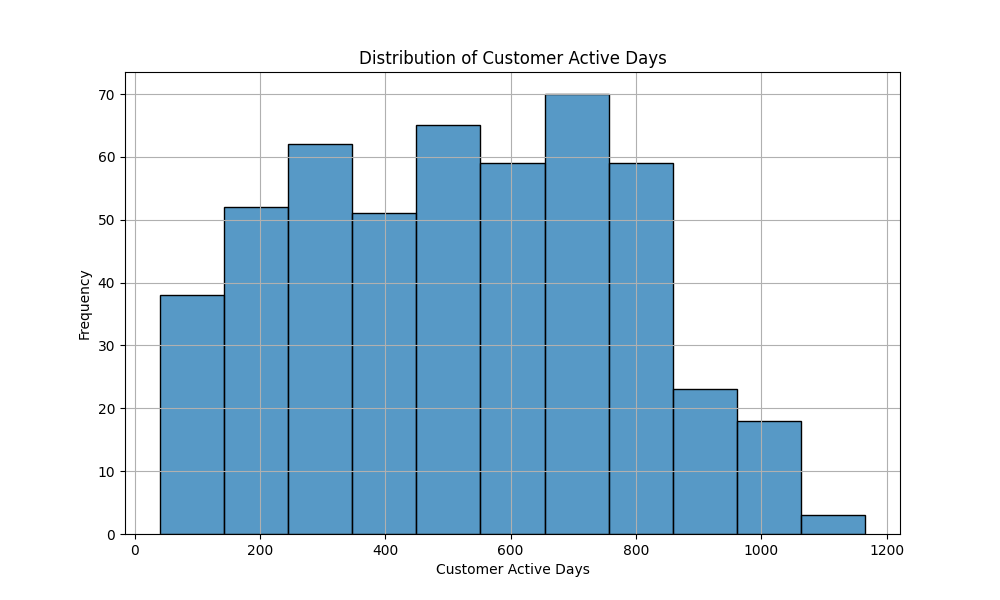
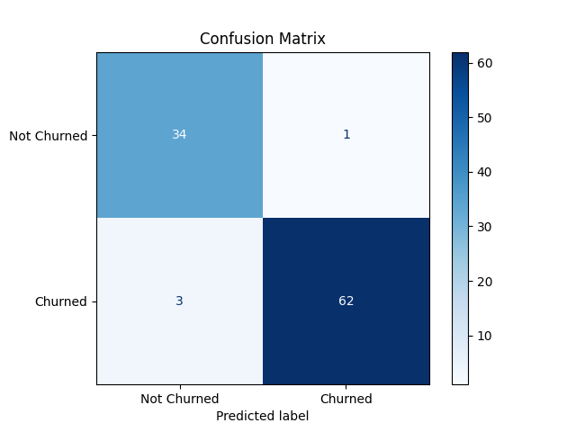

# About me

I am currently pursuing a Master's degree in Artificial Intelligence Systems at EPITA, with a strong academic foundation in AI, data science, and business transformation. My academic path also includes a dual Master’s program from SKEMA Business School and ESIEA, and a Bachelor's degree from the University of Bristol. During my high school and university years, I deepened my understanding of mathematics and statistics through courses such as Further Mathematics, Additional Mathematics, and STEP Mathematics within the A-Level system.

My expertise lies in designing and deploying end-to-end data solutions, integrating machine learning models, and transforming complex data into actionable insights. I am proficient in Python and SQL, which I use extensively for data manipulation, analysis, and automation. I also have solid experience in creating compelling data visualizations and dashboards using Power BI, Tableau, and InDesign, allowing me to effectively communicate insights to both technical and non-technical stakeholders. I have hands-on experience building real-time dashboards with Grafana, developing predictive analytics pipelines, and deploying scalable applications using Docker, FastAPI, and PostgreSQL.

Professionally, I specialize in data cleaning, visualization, and business analysis aimed at driving operational efficiency and business growth. I am currently seeking a six-month internship as a Data Analyst, where I can continue to strengthen my skills in data processing, data mining, and data visualization.

# Education

**2023 - Today**  [EPITA in Msc Arificial Intelligence System](https://www.epita.fr/en/msc-artificial-intelligence-program-overview/)

**2021 - 2023**  [Skema Business School & ESIEA in Msc Artificial Intelligence for Business Transformation](https://www.esiea.fr/en/programmes/msc-artificial-intelligence-for-business-transformation-aibt-bac5/)

**2018 - 2021**  University of Bristol

My topics of interest are the following:

- Data Analysis & Visualization: Creating clear, impactful visualizations using Power BI, Tableau, Grafana, and InDesign to support data-driven decision-making.

- SQL & Data Manipulation: Writing efficient queries and performing complex data transformations for exploratory data analysis and reporting.

- Python for Data Analysis: Using libraries such as Pandas, NumPy, and Matplotlib for data cleaning, preprocessing, and exploratory data analysis.

- Machine Learning Models: Building and interpreting models such as Random Forests, Logistic Regression, and K-Means Clustering for predictive analytics and pattern recognition.

- Business Intelligence: Translating business problems into data solutions and identifying KPIs to support performance tracking and operational improvement.

- Data Pipelines & Automation: Designing data workflows using tools like PostgreSQL, Docker, and FastAPI for efficient data handling and reporting.

- A/B Testing & Hypothesis Testing: Applying statistical techniques to assess business strategies and optimize performance.

# Projects

  <h2>🛍️ Market Customer Data Analysis</h2>
  
<strong>Tech Stack:</strong> Python, Pandas, Matplotlib, Seaborn

  
<strong>Project Overview:</strong> This project aims to analyze customer data from a market to gain insights into purchasing behavior, demographics, and key customer segments.

  
<strong>Key Tasks:</strong>

  <ul>
    <li>🔍 <strong>Exploratory Data Analysis (EDA):</strong> Identified trends in purchase frequency, customer demographics, and product preferences.</li>
    <li>🧹 <strong>Data Cleaning:</strong> Handled missing values, outliers, and encoding of categorical variables.</li>
    <li>📊 <strong>Visualization:</strong> Created visualizations to show purchase behavior across age and product categories.</li>
    <li>🤖 <strong>Modeling:</strong> Trained a Random Forest Classifier to predict high-value customers.</li>
    <li>📁 <strong>Modularization:</strong> Designed a flexible Python pipeline using config files and reusable modules for easier data analysis and scalability.</li>
  </ul>

  
<strong>My Role:</strong> I was responsible for data cleaning, exploratory data analysis (EDA), data visualization, variable correlation analysis, and customer behavior modeling.

  

    
    
<em>Figure 1: Distribution of active customer days showing frequency of customer interactions.</em>

    
    
<em>Figure 2: Performance evaluation of the Random Forest Classifier based on confusion matrix metrics.</em>

  

  

    🔗 <a href="https://github.com/Icybrig/Market-Customer-Data-Analysis" target="_blank">View the project on GitHub</a>
  

  <h2>🚗 Automotive Market Sales Analysis</h2>
  
<strong>Tech Stack:</strong> Python, PostgreSQL, Pandas, Seaborn, FastAPI, Power BI

  
<strong>Project Overview:</strong> This end-to-end project analyzes global automotive market data, comparing thermal and electric engine sales across brands and countries. It integrates SQL queries, data visualization, and an API layer for dashboarding with Power BI.

  
<strong>Key Tasks:</strong>

  <ul>
    <li>🧹 <strong>Data Cleaning:</strong> Cleaned and standardized data from car specs and customer behavior datasets.</li>
    <li>🔗 <strong>Database Integration:</strong> Created PostgreSQL schema and used Python (psycopg2) to insert cleaned data.</li>
    <li>🧠 <strong>Business Querying:</strong> Wrote SQL queries to answer 5 core business questions around sales, brand performance, and engine types.</li>
    <li>📊 <strong>Visualization:</strong> Visualized trends in engine popularity and brand dominance using Seaborn.</li>
    <li>🌐 <strong>Power BI API:</strong> Built a FastAPI server to expose key SQL insights to Power BI via JSON endpoints.</li>
  </ul>

  
<strong>My Role:</strong> I independently handled the full project pipeline, including data ingestion, SQL logic, visualization, and backend API development.

  

    
    
<em>Figure 1: Engine type distribution showing the popularity of electric vs thermal engines.</em>

    
    
<em>Figure 2: Total sales volume comparison across years by engine type.</em>

  

  

    🔗 <a href="https://github.com/Icybrig/Automotive-Market-Sales-Analysis" target="_blank">View the project on GitHub</a>
  

  <h2>🧠 Black Friday Purchase Prediction (DSP Final Project)</h2>
  
<strong>Tech Stack:</strong> Apache Airflow, PostgreSQL, Python, FastAPI, Streamlit, Grafana

  
<strong>Project Overview:</strong> A complete data engineering and analytics pipeline designed to predict customer purchasing behavior from Black Friday retail data. The project integrates real-time data workflows, predictive modeling, and interactive dashboards.

  
<strong>Key Tasks:</strong>

  <ul>
    <li>📥 <strong>Data Ingestion:</strong> Used Apache Airflow to schedule and automate ETL workflows from raw CSV sources to PostgreSQL.</li>
    <li>🧹 <strong>Data Cleaning:</strong> Preprocessed and transformed user demographics and purchase records using Pandas and custom scripts.</li>
    <li>📈 <strong>Model Training:</strong> Built a machine learning model to predict user purchase amounts based on input features.</li>
    <li>🖥 <strong>Dashboard Interface:</strong> Developed a Streamlit app to allow interactive exploration of prediction outcomes.</li>
    <li>🧪 <strong>API Development:</strong> Served model predictions via FastAPI endpoints, enabling integration with external tools.</li>
    <li>📊 <strong>Monitoring:</strong> Used Grafana to visualize database metrics and track system performance in real time.</li>
  </ul>

  
<strong>My Role:</strong> I contributed to the full pipeline including data ingestion, modeling, API deployment, and dashboard development as part of a collaborative four-member team.

  

    
    
<em>Figure: High-level architecture of the data pipeline integrating ETL, model serving, and visualization tools.</em>

  

  

    🔗 <a href="https://github.com/callmeeric5/DSP_Final" target="_blank">View the project on GitHub</a>
  

